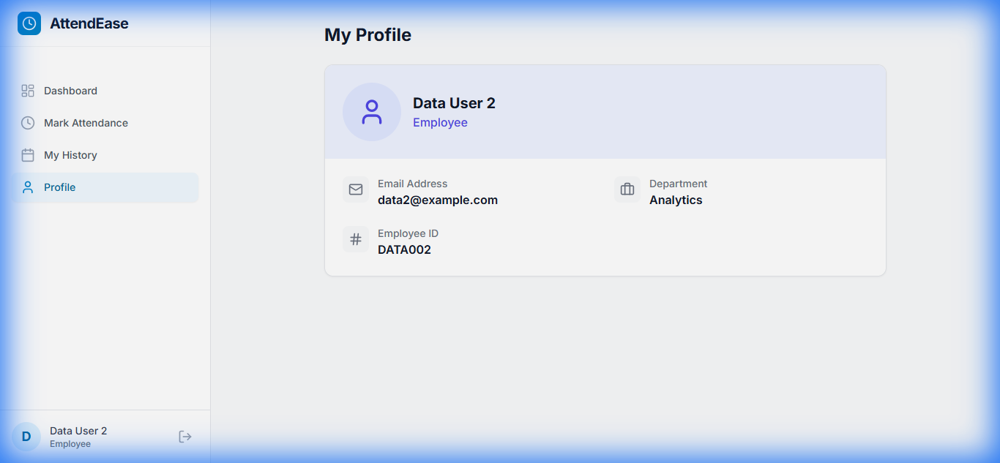
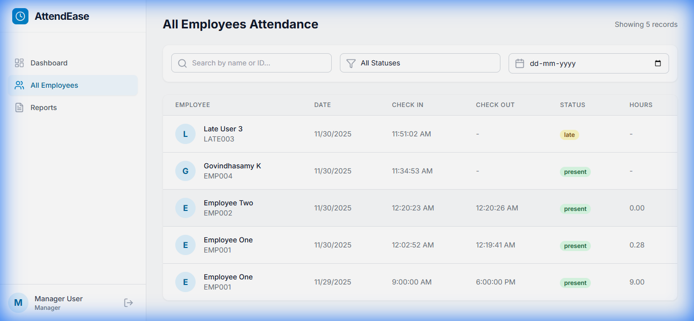

# Employee Attendance System

A full-stack Employee Attendance System built with the MERN stack (MongoDB, Express, React, Node.js).

#by
Govindhasamy K
Indra Ganesan College of Engineering , Tiruchirappalli 
contact No : 8681058703

## Features

### Employee
- **Register/Login**: Secure authentication with role-based access.
- **Dashboard**: View today's status, recent activity, and stats.
- **Mark Attendance**: Quick Check In/Check Out.
- **History**: View detailed attendance history.
- **Profile**: View profile details (Department, Employee ID).
- **Late Arrival Logic**: Automatically marks status as "Late" if checked in after 9:00 AM.

### Manager

### 1. Clone the repository
```bash
cd client
npm install
npm run dev
```

### 4. Access the App
Open [http://localhost:5173](http://localhost:5173) in your browser.

## Environment Variables

Create a `.env` file in the `server` directory with the following variables:

```env

### Employee Profile


### Manager Dashboard (All Employees)

